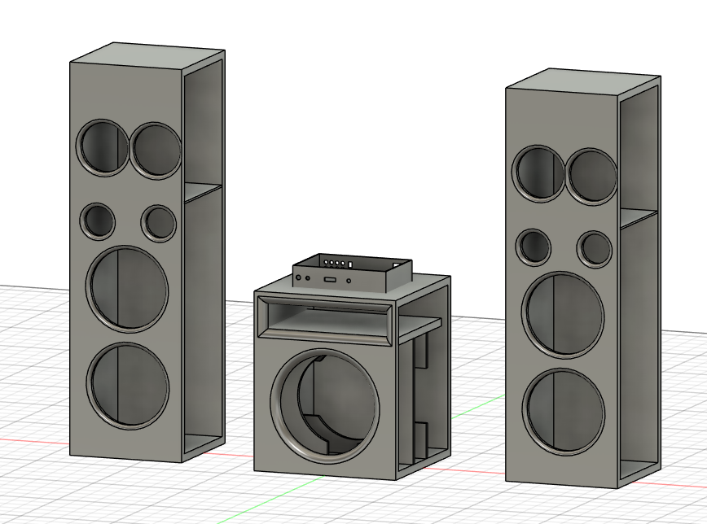
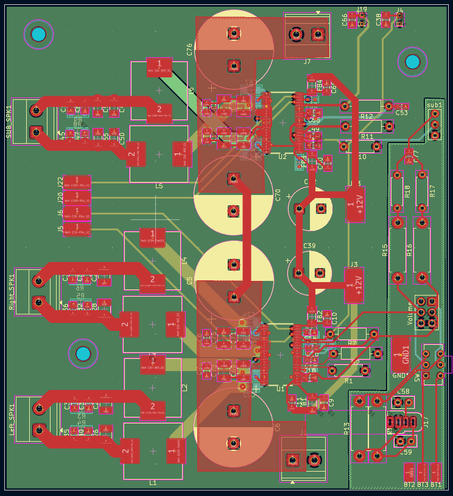
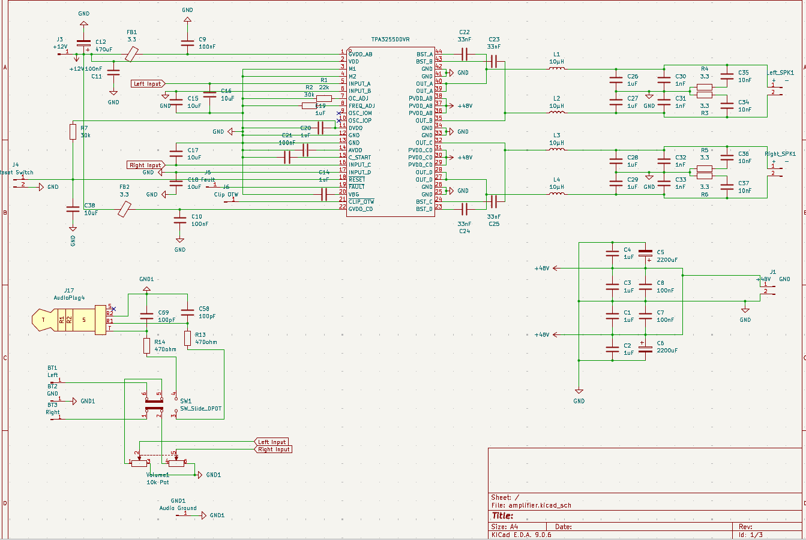
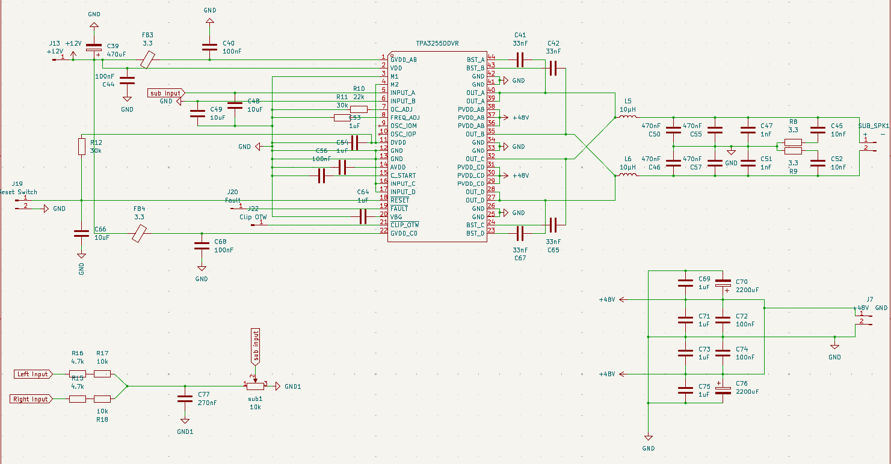
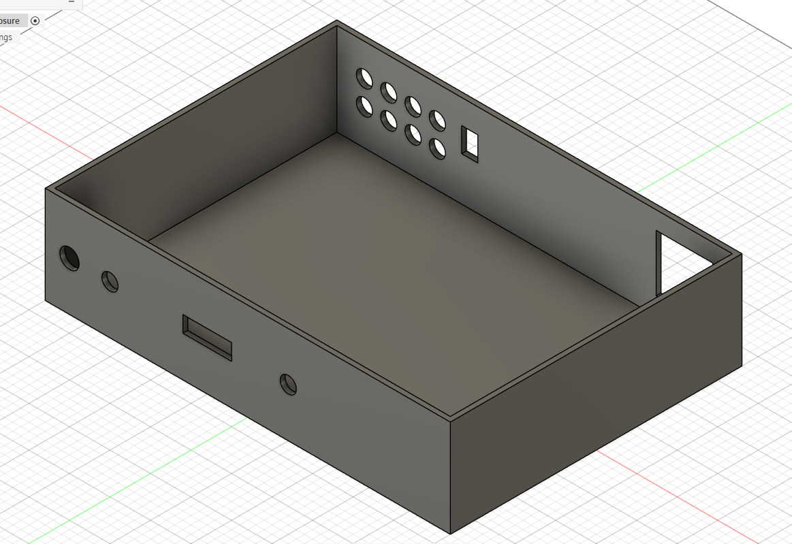
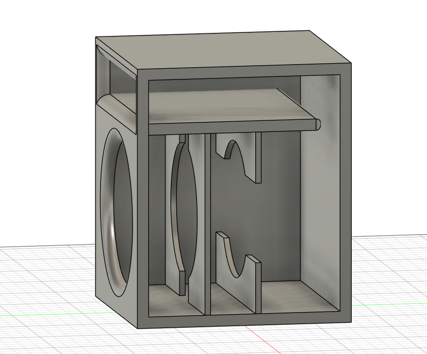
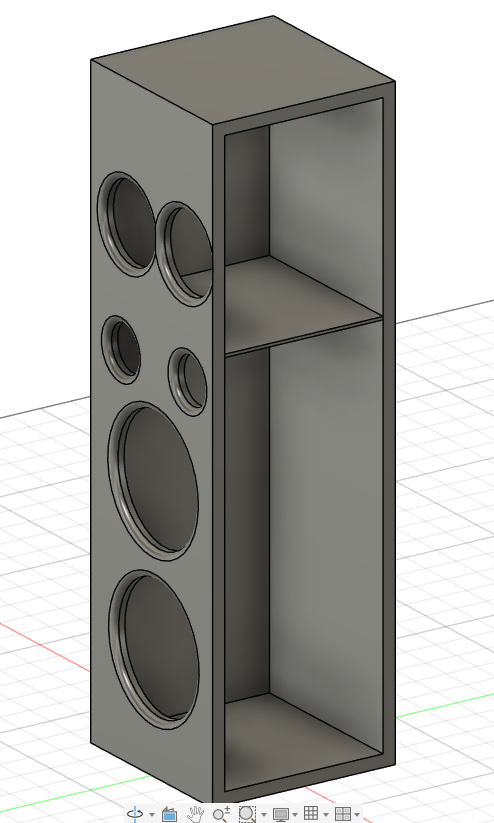
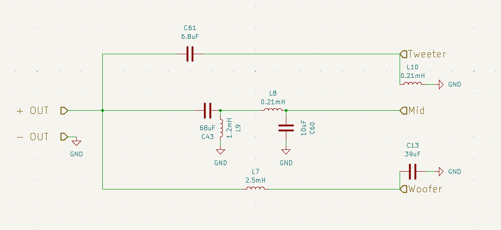

# DIY 3-Way Speaker Crossover + Amplifier System

This project is a custom-built 3-way audio system designed from scratch, including the amplifier, crossover network, and speaker configuration. The goal was to create a solid, practical setup that delivers good sound without overcomplicating the design.

---

## 🔊 System Overview

- Subwoofer: 10" DVC (handles low frequencies)
- Tower Speakers (x2):
  - 2 × Woofers (connected in series → 8Ω)
  - 1 × Midrange driver (4Ω)
  - 1 × Tweeter (4Ω)

- Passive 3-way crossover (2nd order)
- Custom PCB amplifier
  - Dual TPA3255 based amplifier

---

## 📸 Screenshots

### Full Build

### PCB Layout

---

### Schematic

---

### 3D Model

---

### Crossover Design

---

## ⚙️ How It Works (Short)

The Power supply power up the sytem and then 48V and 12V are sent to amp power pins, and then 12v is also used to power up the fans for cooling the HOT TPA3255 chips, then the 5v is sent to bt module

after that we select aux or bt input through the dpdt switch, and the signal goes to the tower amp and a 80hz cutoff is sent to the sub amp, the amp amplify the dignal and then the amplifier sends a full-range audio signal to the crossover in tower speaker and the cutoff freq to sub.

The crossover splits this signal into three parts:

- Low frequencies → go to the woofers  
- Mid frequencies → go to the mid driver  
- High frequencies → go to the tweeter  

This is done using inductors and capacitors arranged as filters:

- Inductors block high frequencies  
- Capacitors block low frequencies  

Each driver only receives the frequencies it is meant to play, improving clarity and reducing distortion.

---

## 🧠 Design Choices

- TPA3255 for 250 watt per channel and 300-600 Watt for sub
- Used a 2nd order crossover (12dB/octave) for better separation   
- used a active crossover for sub to save cost

---

## 🧾 Components Used

BOM list present in the bom.csv in this repo root directory

---

## 🚀 Status

- [x] Amplifier designed  
- [x] PCB layout completed  
- [x] Crossover designed
- [X] Input Stage made
- [X] SUB frequecny cutoff of 80hz made
- [X] Tuned Enclosure design made
- [X] Drivers selected
- [X] BOM made
- [ ] Assembly  
- [ ] Testing  

---

## 📌 Future Improvements

- Fine-tune crossover after listening tests  
- Improve enclosure design  
- Add damping and internal bracing  

---

This is a work-in-progress build focused on learning and practical implementation rather than perfection.
